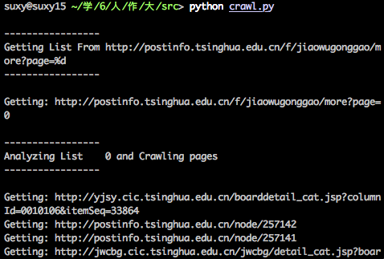
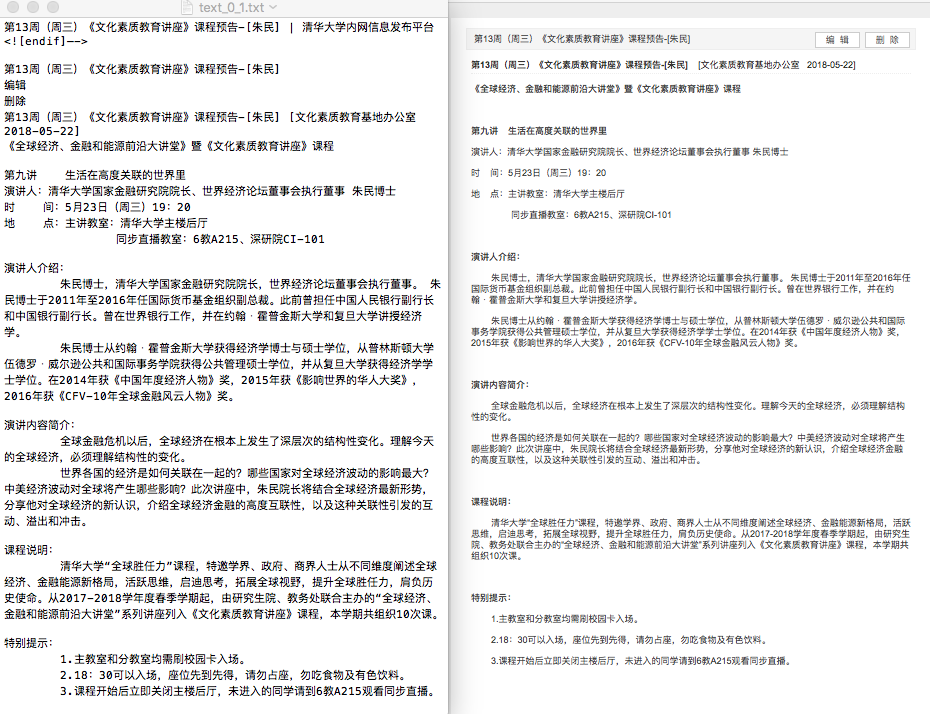
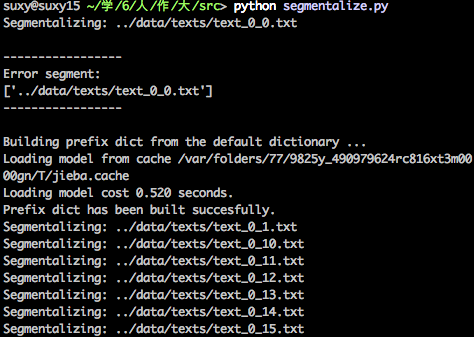
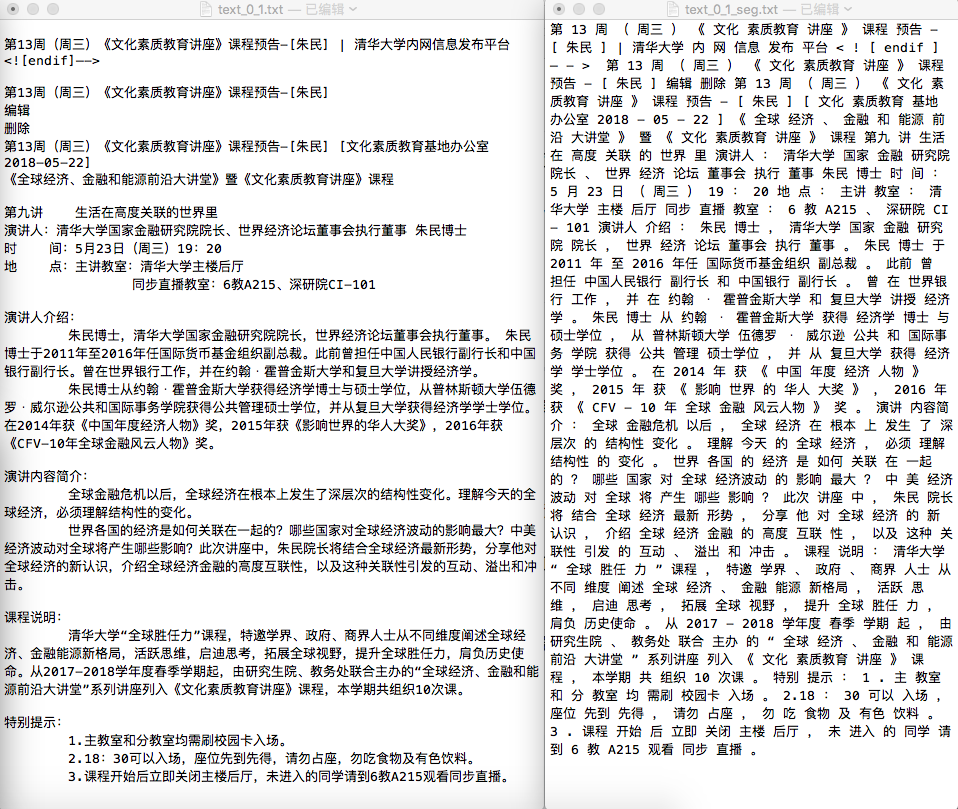
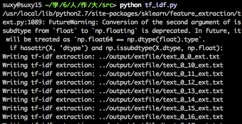
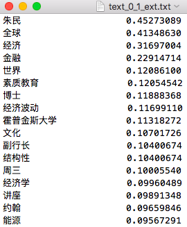

## Information Calender based on Key Word Extraction and Classification

ChenHui Jia 2014010757<br>Xingyu Su 2015010697

[TOC]

### Motivation

Drawing keywords from an article is an efficient and necessary way to help readers to understand the main idea of the article and choose to read it or not. Especially for the Internet Era, large amounts of information is poured out everyday. If it is not preprocessed, it will become the burden of web browsers.
For us students, we need some extra time to check if there is important message or announcement on [info.tsinghua.edu.cn](info.tsinghua.edu.cn). Movitated by this inconvenience, we intend to implement a information calender that can handle noticements and articles of platforms like info.tsinghua or huxiu (虎嗅). Users can just open the calender and check information by date or topics or types.

### Content

> package needed: scikit-learn, jieba, thulac

#### 0. Tree of Code

``` shell
.
├── data
│   ├── error_getting.txt      :output of crawling error
│   ├── error_parsing.txt      :output of parsing error
│   ├── error_segment.txt      :output of segmenting error
│   ├── error_writing.txt      :output of writing error
│   ├── lists/                 :dir to save list files
│   ├── pages/                 :dir to save page files
│   └── texts/                 :dir to save text files
├── output
│   ├── extfile/               :dir to save extracted files
│   └── segfile/               :dir to save segmented files
└── src
    ├── config.cfg             :configure file, change settings here
    ├── crawl.py               :crawler, crawl lists, pages, and handle texts
    ├── segmentalize.py        :segmentalizer, segmentalize texts to segfile
    ├── tf_idf.py              :tf-idf extractor, extract keywords by tf-idf
    ├── util.py                :utilization, provide tools 
    └── util.pyc
```

#### 1. Crawler

The Crawler is designed to fetch data from destination website and handle the raw data by filtering unnecessary message. `axel` and `urllib2` are used to get resources from url. The url format is needed like `http://postinfo.tsinghua.edu.cn/f/jiaowugonggao/more?page=%d`, where you can set `%d` with different number so that it can get resources from a list of urls.

`HTMLParser` is used to analysis html files and transfer original pages to message texts. The extracting mode is based on your goal sites' format. In `info.tsinghua.edu.cn`, we can just extract list to links with titles and timestamps and extract pages to simple txt files (for picture might needed, its source format is remained).

`Crawler.py` is used as below:



After crawling and parsing, the pure text can be get as follow. (`left: txt content`, `right: original html`)



#### 2. Segmentalizer

The segmentalizer is choosed to segment text to words.

##### 2.1 Jieba

Here the [python tool `jieba`](https://pypi.org/project/jieba/) is used. The algorithm it used can be described as: [[from src]](https://github.com/fxsjy/jieba)

>  基于前缀词典实现高效的词图扫描，生成句子中汉字所有可能成词情况所构成的有向无环图 (DAG)
>
> 采用了动态规划查找最大概率路径, 找出基于词频的最大切分组合
>
> 对于未登录词，采用了基于汉字成词能力的 HMM 模型，使用了 Viterbi 算法

Code can be run by:



The segmented example is showed as below:



##### 2.2 THULAC

And the Tsinghua NLP Lab's tool [THULAC](thulac.thunlp.org) will be used in the future work.

#### 3. Extractor

The extractor is to get the importance of every word in every document.

##### 3.1 TF-IDF

Here the TF-IDF algorithm is implement in `tf_idf.py`, its theory can be described as:

​	TF means Term Frequency, $TF_{i,j}$ is the frequence of word $w_j$ in document $d_i$
$$
TF_{i,j} = \frac{\sum_{k=1}^{n_i} (1 \,\,\,\, if \,\,\,\, w_{i,k}==w_j \,\,\,\, else \,\,\,\, 0)}{n_i}
$$
where $n_i =  |\{k: w_{i,k} \in d_i \}|$, is the number of words of document $d_i$.

​	IDF means Inverse Document Frequency, represent how many documents contain word $w_{j}$
$$
IDF_j = \log \frac{|\{ i: d_i \in D\}|}{|\{ i: w_j \in d_i \}|}
$$
​	And the importance of word $w_j$ in document $d_i$ , $p_{i,j}$ is:
$$
p_{i,j} = TF_{i,j} \times IDF_{j}
$$
The `sklearn.feature_extraction.text.TfidfTransformer` is used in this part. And the script `tf_idf.py` can be run by:



The extracted result is a list of word and its weight of importance, the result of `tf_idf.py` is showed as below:



##### 3.2 TextRank

```
util.raiseNotDefined()
```

##### 3.3 Word2Vec

```
util.raiseNotDefined()
```